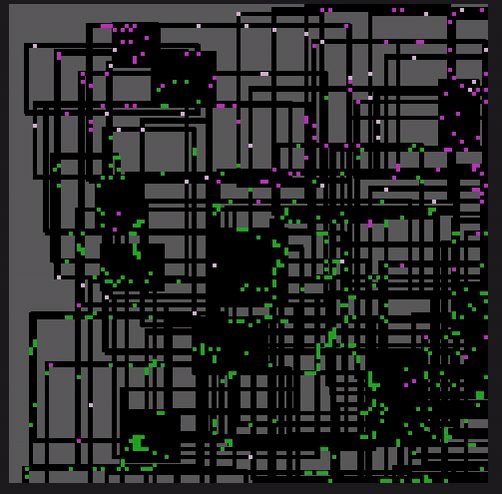

# Zombie Infection Simulation

## Intro

A simple yet entertaining zombie simulator. A single infected/zombie appears at a randomly generated city, just watch how it bites and transforms other humans into more zombies.

Can play it online at [https://kartones.net/demos/026/](https://kartones.net/demos/026/).

Migrated from Java to Javascript (with some tweaks) from ["Zombie Infection Simulation v2.3 - The Original", by Kevan Davis](https://kevan.org/proce55ing/zombies/).

## Instructions

Just press spacebar, or click or tap on the city image/canvas to pause/unpause. Other commands (keyboard shortcuts) are 

### Simulation Rules

Zombies are green, move slowly and change direction randomly and frequently unless they can see something moving in front of them, in which case they start walking towards it. After a while they get bored and wander randomly again.

If a zombie finds a survivor standing directly in front of it, it bites and infects them; the survivor immediately joins the ranks of the undead.

Survivors are pink and run, occasionally changing direction at random. If they see a zombie directly in front of them, they turn around and panic.

Panicked survivors are bright pink. If a survivor sees another panicked survivor, it starts panicking as well. A panicked survivor who has seen nothing to panic about for a while will calm down again.

## License

See [LICENSE](LICENSE).
