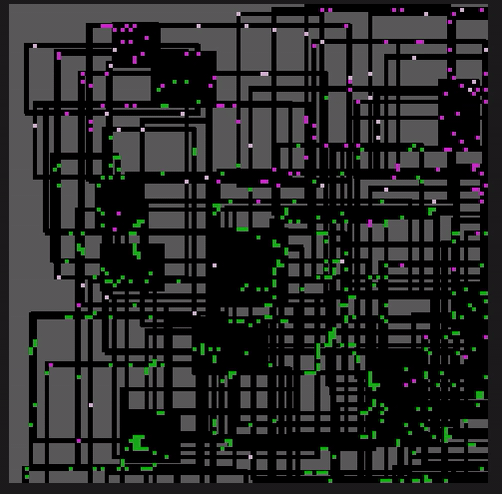

# Zombie Infection Simulation


## Introduction

A simple yet entertaining zombie simulator. A single infected/zombie appears at a randomly generated city, just watch how it bites and transforms other humans into more zombies.



Can play it online at [https://kartones.net/demos/026/](https://kartones.net/demos/026/).


Migrated from Java to Javascript (with some tweaks) from ["Zombie Infection Simulation v2.3 - The Original", by Kevan Davis](https://kevan.org/proce55ing/zombies/).

## Instructions

<p>Simulation Rules:</p>
<ul>
<li><i class="entity-zombie">Zombies</i> are green, move slowly and change direction randomly and frequently unless they can see something moving in front of them, in which case they start walking towards it. After a while they get bored and wander randomly again.<br/>If a zombie finds a survivor standing directly in front of it, it bites and infects them; the survivor immediately joins the ranks of the undead.</li>
<li><i class="entity-human">Survivors</i> are pink and walk, occasionally changing direction at random. If they see a zombie directly in front of them, they turn around and panic.</li>
<li><i class="entity-human-panic">Panicked survivors</i> are magenta and run. If a survivor sees another panicked survivor, it starts panicking as well. A panicked survivor who has seen nothing to panic about for a while will calm down again.</li>
<li>Policemen are <i class="entity-policeman">blue</i>. They behave as humans, but if they see a single zombie, they will shoot it. If they see multiple zombies, they will panic and flee, as normal humans. Note that a shoot might miss.</li>
</ul>


Controls are detailed at the [index.html](index.html) file.

## Running locally

Sound requires serving over HTTP (not `file://`). From the project root:

```
http-serve .
```

Then open `http://localhost:8080` in your browser.

## License

See [LICENSE](LICENSE).
